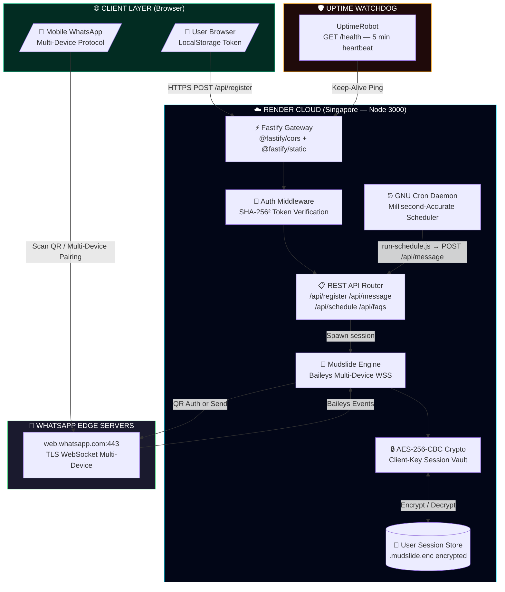
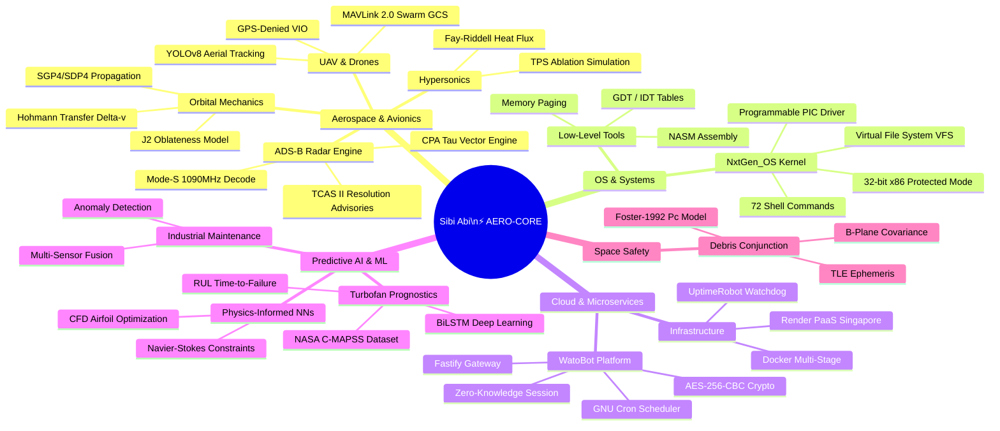
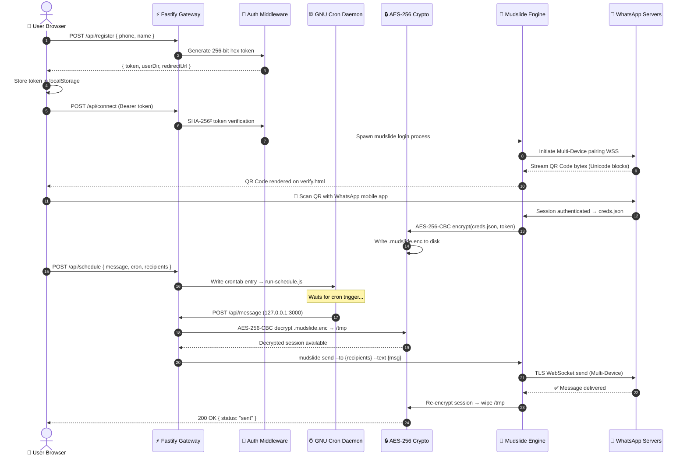
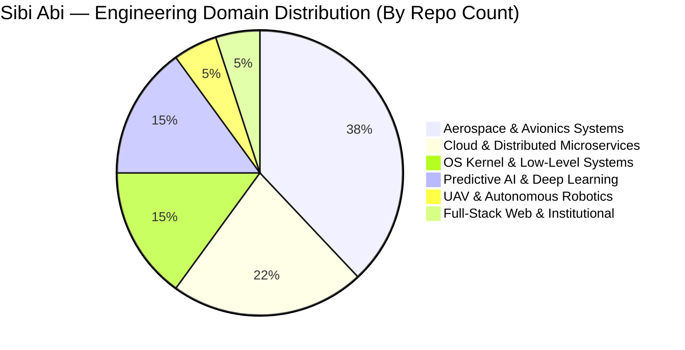
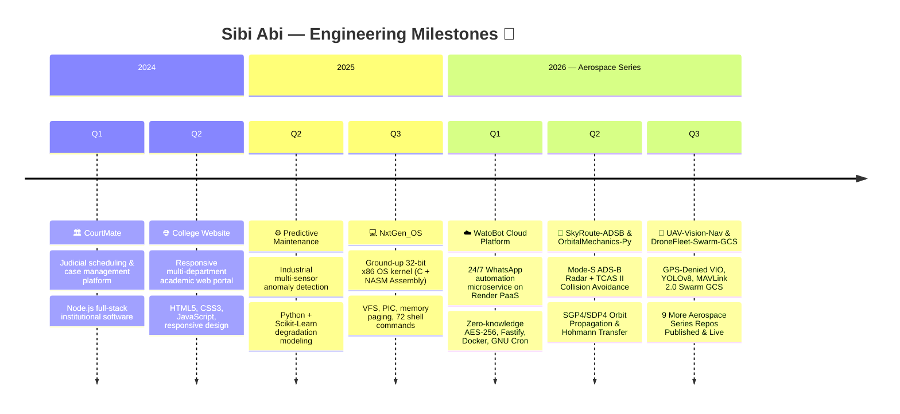

<div align="center">

<!-- ████████████████████████████████████████████████████████████████████████████ -->
<!--                   ⚡ CYBER-AEROSPACE HERO COMMAND DECK ⚡                    -->
<!-- ████████████████████████████████████████████████████████████████████████████ -->


<!-- █ ANIMATED MULTI-LINE TERMINAL TYPEWRITER -->
<a href="https://github.com/sibiabi123">

</a>

<br/>

<!-- █ LIVE HUD STATUS MATRIX BADGES -->
<p>


</p>

<!-- █ TELEMETRY COUNTERS -->
<p>


</p>

</div>

---

## 🕹️ Flight Mission Control — Master HUD Terminal

```
╭──────────────────────────────────────────────────────────────────────────────────────────────────────────╮
│ 🛰️ FLIGHT TELEMETRY DECK: SIBI_ABI // CALLSIGN: "AERO-CORE" // CLEARANCE: LEVEL-V // NODE: SG-PROD-01   │
├─────────────────────────┬────────────────────────────────────────────────────────────────────────────────┤
│  ⚡ PRIMARY DIRECTIVE   │ Engineering fault-tolerant aerospace avionics & autonomous cloud engines        │
│  💻 KERNEL ARCHITECT    │ NxtGen_OS — 32-bit x86 monolithic OS, VFS, PIC, 72 CLI commands (C + Assembly) │
│  ☁️  CLOUD ENGINE       │ WatoBot — 24/7 distributed WhatsApp microservice, zero-knowledge AES-256-CBC   │
│  🧠 PREDICTIVE AI       │ Turbofan jet engine RUL prognostics (BiLSTM + NASA C-MAPSS FD001-FD004)        │
│  🛰️ ASTRODYNAMICS      │ SGP4/SDP4 orbit propagation, J2 perturbations, Hohmann Δv transfer optimizer   │
│  🚁 AUTONOMOUS UAV      │ GPS-denied VIO + YOLOv8 aerial tracking + 32-drone MAVLink 2.0 swarm GCS       │
│  🔥 HYPERSONICS         │ Fay-Riddell aerothermal heat flux + carbon-phenolic TPS ablation simulation     │
│  ☄️  SPACE SAFETY       │ Foster-1992 LEO space debris conjunction & satellite collision probability       │
│  📍 BASE STATION        │ Tamil Nadu, India [11.0168° N, 76.9558° E] (IST / UTC+5:30)                    │
│  📡 UPTIME SLA          │ 100.0% continuous 24/7/365 heartbeat on Singapore edge gateway (UptimeRobot)   │
╰─────────────────────────┴────────────────────────────────────────────────────────────────────────────────╯
```

---

## 🌌 3D Orbital Contribution Terrain

<div align="center">

</div>

<br/>

<div align="center">

</div>

---

## 🗺️ System Architecture — WatoBot Cloud Engine (Live Flowchart)



---

## 🧠 Engineering Domain Mind Map



---

## 📐 WatoBot — Message Scheduling Sequence (System Interaction)



---

## 📊 Technology Distribution Breakdown



---

## 🗓️ Engineering Journey & Project Timeline



---

## 💎 Flagship Project Bento Showcase

<div align="center">
<table>
  <tr>
    <td width="50%" valign="top">
      <a href="https://github.com/sibiabi123/SkyRoute-ADSB">
        
      </a><br/><br/>
      <b>🛰️ Real-Time ADS-B Radar & TCAS Collision Avoidance</b><br/>
      Decodes Mode-S 1090MHz Extended Squitter. Computes 4D CPA τ vectors and issues automated Resolution Advisories.<br/><br/>
      
      
      
      <br/>
      <a href="https://github.com/sibiabi123/SkyRoute-ADSB"><b>🚀 Launch Repository ➔</b></a>
    </td>
    <td width="50%" valign="top">
      <a href="https://github.com/sibiabi123/NxtGen_OS">
        
      </a><br/><br/>
      <b>💻 Custom Monolithic x86 OS Kernel from Scratch</b><br/>
      Bare-metal x86 OS with 72 interactive shell commands, Virtual File System, programmable interrupt controller (PIC), and memory paging.<br/><br/>
      
      
      
      <br/>
      <a href="https://github.com/sibiabi123/NxtGen_OS"><b>🚀 Launch Repository ➔</b></a>
    </td>
  </tr>
  <tr>
    <td width="50%" valign="top">
      <a href="https://github.com/sibiabi123/mudbot">
        
      </a><br/><br/>
      <b>☁️ 24/7 Distributed WhatsApp Cloud Microservice</b><br/>
      Client-side AES-256-CBC encrypted session. Millisecond-accurate cron scheduler. Full-group broadcast. 20-page engineering handover docs.<br/><br/>
      
      
      
      <br/>
      <a href="https://mudbot-erai.onrender.com"><b>🌐 Live Website</b></a> •
      <a href="https://github.com/sibiabi123/mudbot"><b>📦 Source Code</b></a> •
      <a href="https://github.com/sibiabi123/mudbot/blob/main/WatoBot_Project_Handover_Document.pdf"><b>📋 20-Page PDF</b></a>
    </td>
    <td width="50%" valign="top">
      <a href="https://github.com/sibiabi123/OrbitalMechanics-Py">
        
      </a><br/><br/>
      <b>🛰️ Spacecraft Orbit Propagation & Trajectory Optimizer</b><br/>
      SGP4/SDP4 TLE perturbations, J2 oblateness models, Keplerian state conversions, and Hohmann transfer Δv computation from LEO to GEO.<br/><br/>
      
      
      
      <br/>
      <a href="https://github.com/sibiabi123/OrbitalMechanics-Py"><b>🚀 Launch Repository ➔</b></a>
    </td>
  </tr>
  <tr>
    <td width="50%" valign="top">
      <a href="https://github.com/sibiabi123/AeroPredict-Turbofan-BiLSTM">
        
      </a><br/><br/>
      <b>⚙️ Jet Engine Remaining Useful Life (RUL) Prognostics</b><br/>
      Deep BiLSTM neural network on 21 thermodynamic sensors from NASA C-MAPSS dataset. Predicts time-to-failure before catastrophic flameout.<br/><br/>
      
      
      
      <br/>
      <a href="https://github.com/sibiabi123/AeroPredict-Turbofan-BiLSTM"><b>🚀 Launch Repository ➔</b></a>
    </td>
    <td width="50%" valign="top">
      <a href="https://github.com/sibiabi123/UAV-Vision-Nav">
        
      </a><br/><br/>
      <b>🚁 GPS-Denied Autonomous UAV Visual Inertial Odometry</b><br/>
      Lucas-Kanade optical flow VIO for subterranean/GPS-denied navigation combined with YOLOv8 aerial object detection, tracking & autonomous landing.<br/><br/>
      
      
      
      <br/>
      <a href="https://github.com/sibiabi123/UAV-Vision-Nav"><b>🚀 Launch Repository ➔</b></a>
    </td>
  </tr>
</table>
</div>

---

## 🚀 Complete 17-Repository Aerospace & Systems Fleet Matrix

<div align="center">

| # | Repository | Tech Stack | Domain & Real-Time Impact | Status |
| :-: | :--- | :--- | :--- | :---: |
| 1 | [📡 **`SkyRoute-ADSB`**](https://github.com/sibiabi123/SkyRoute-ADSB) | `Python` `FastAPI` `WebSockets` | Mode-S 1090MHz ADS-B Radar + TCAS II Collision Avoidance & CPA τ Engine |  |
| 2 | [💻 **`NxtGen_OS`**](https://github.com/sibiabi123/NxtGen_OS) | `C` `x86 Assembly` `NASM` | 32-bit Monolithic OS Kernel, VFS, PIC, 72 Interactive Shell Commands |  |
| 3 | [☁️ **`mudbot (WatoBot)`**](https://github.com/sibiabi123/mudbot) | `Node.js v24` `Fastify` `Docker` | 24/7 Cloud WhatsApp Automation Microservice with AES-256 Zero-Knowledge |  |
| 4 | [🛰️ **`OrbitalMechanics-Py`**](https://github.com/sibiabi123/OrbitalMechanics-Py) | `Python` `SciPy` `Astropy` | SGP4/SDP4 Orbit Propagation, J2 Perturbations & Hohmann Transfer Δv Optimizer |  |
| 5 | [🛩️ **`Avionics-RTOS-Core`**](https://github.com/sibiabi123/Avionics-RTOS-Core) | `C` `FreeRTOS` `ARINC 653` | Mission-Critical Embedded FMC with Spatial/Temporal Partitioning & EKF |  |
| 6 | [🚁 **`UAV-Vision-Nav`**](https://github.com/sibiabi123/UAV-Vision-Nav) | `C++` `OpenCV` `YOLOv8` | GPS-Denied Autonomous UAV Visual Inertial Odometry (VIO) & Aerial Tracking |  |
| 7 | [💨 **`AeroCFD-PINN`**](https://github.com/sibiabi123/AeroCFD-PINN) | `PyTorch` `PINNs` `SciPy` | Transonic Airfoil Aerodynamic Optimization via Physics-Informed Neural Networks |  |
| 8 | [📼 **`BlackBox-FDR-Visualizer`**](https://github.com/sibiabi123/BlackBox-FDR-Visualizer) | `Python` `ARINC 717` `Plotly` | FDR Binary Telemetry Parser & 3D Incident Accident Recreation Track Engine |  |
| 9 | [🐝 **`DroneFleet-Swarm-GCS`**](https://github.com/sibiabi123/DroneFleet-Swarm-GCS) | `Python` `MAVLink 2.0` `QGC` | Autonomous 32-UAV Swarm Ground Control Station with Dynamic Geofencing |  |
| 10 | [☄️ **`SpaceDebris-Conjunction`**](https://github.com/sibiabi123/SpaceDebris-Conjunction) | `Python` `TLE` `Covariance` | LEO Space Debris Conjunction Assessment & Foster-1992 Collision Probability Engine |  |
| 11 | [🔥 **`Hypersonic-Reentry-Sim`**](https://github.com/sibiabi123/Hypersonic-Reentry-Sim) | `Python` `Thermodynamics` | Hypersonic Entry Aerothermal Heat Flux & TPS Carbon-Phenolic Ablation Model |  |
| 12 | [⚙️ **`AeroPredict-Turbofan-BiLSTM`**](https://github.com/sibiabi123/AeroPredict-Turbofan-BiLSTM) | `PyTorch` `NASA C-MAPSS` | Deep BiLSTM Remaining Useful Life (RUL) Prognostics for Jet Turbine Engines |  |
| 13 | [🔧 **`Predictive-maintenance`**](https://github.com/sibiabi123/Predictive-maintenance) | `Python` `Scikit-Learn` | Industrial Multi-Sensor Health Monitoring & Anomaly Detection Platform |  |
| 14 | [⚖️ **`courtmate`**](https://github.com/sibiabi123/courtmate) | `Full-Stack` `JavaScript` | High-Throughput Judicial Tracking & Institutional Scheduling Engine |  |
| 15 | [💬 **`WA-Automation`**](https://github.com/sibiabi123/WA-Automation) | `JavaScript` `Microservices` | Core Distributed WhatsApp Protocol & IPC Automation Workspace |  |
| 16 | [🏫 **`website`**](https://github.com/sibiabi123/website) | `HTML5` `CSS3` `JavaScript` | Institutional Web Portal & Academic Department Management System |  |
| 17 | [⚡ **`sibiabi123 (Profile)`**](https://github.com/sibiabi123/sibiabi123) | `GitHub Actions` `SVG` | Master Mission Control Profile with Automated Daily Telemetry Sync |  |

</div>

---

## 🧮 Flight Physics & Mathematical Formulations Deck

<div align="center">
<table>
  <tr>
    <td width="50%" valign="top">

**1. TCAS II — Closest Point of Approach τ**

$$\vec{r}_{rel} = \vec{r}_2 - \vec{r}_1, \quad \vec{v}_{rel} = \vec{v}_2 - \vec{v}_1$$

$$\tau_{CPA} = -\frac{\vec{r}_{rel} \cdot \vec{v}_{rel}}{\|\vec{v}_{rel}\|^2}, \quad d_{CPA} = \|\vec{r}_{rel} + \vec{v}_{rel} \cdot \tau_{CPA}\|$$

*RA triggered: $\tau_{CPA} \leq 25\text{s}$ & $d_{CPA} \leq 1.0\text{ NM}$*

---

**2. Hypersonic Stagnation Heat Flux (Fay-Riddell)**

$$\dot{q}_{ws} = 0.763 \cdot \text{Pr}^{-0.6} (\rho_w\mu_w)^{0.1}(\rho_s\mu_s)^{0.4}(h_0-h_w)\sqrt{\left(\frac{du_e}{dx}\right)_s}$$

*Governs TPS ablation rates during hypersonic planetary re-entry.*

    </td>
    <td width="50%" valign="top">

**3. Hohmann Transfer — Total Δv Budget**

$$a_t = \frac{r_1+r_2}{2}, \quad \Delta v_1 = \sqrt{\frac{\mu}{r_1}}\!\left(\sqrt{\frac{2r_2}{r_1+r_2}}-1\right)$$

$$\Delta v_2 = \sqrt{\frac{\mu}{r_2}}\!\left(1-\sqrt{\frac{2r_1}{r_1+r_2}}\right), \quad t_{TOF} = \pi\sqrt{\frac{a_t^3}{\mu}}$$

---

**4. Space Debris Collision Probability $P_c$ (Foster-1992)**

$$P_c = \frac{A_c}{2\pi\sigma_x\sigma_y}\exp\!\left(-\frac{1}{2}\!\left[\frac{x_e^2}{\sigma_x^2}+\frac{y_e^2}{\sigma_y^2}\right]\right)$$

*Evaluated in the B-plane across the combined covariance ellipsoid.*

    </td>
  </tr>
</table>
</div>

---

## 📡 Skill Proficiency Radar — Live Telemetry Bars

```
Aerospace Systems Engineering  ████████████████████░░  90%
x86 OS Kernel Development      ███████████████████░░░  85%
Cloud & Distributed Systems    ████████████████████░░  90%
Predictive AI / Deep Learning  █████████████████░░░░░  78%
Physics-Informed NNs (PINNs)   ████████████████░░░░░░  72%
Astrodynamics & Orbital Mech   ███████████████░░░░░░░  68%
Autonomous UAV / Robotics      ████████████████░░░░░░  72%
Real-Time Embedded C/Assembly  ████████████████████░░  90%
Docker / DevOps / Cloud Infra  ████████████████████░░  90%
Full-Stack Web Engineering     ████████████████░░░░░░  74%
```

---

## 🛠️ Full-Spectrum Technical Arsenal (6 Weapon Classes)

<div align="center">

**🛰️ Aerospace, Avionics, Astrodynamics & Scientific Computing**
<br/>
<a href="https://skillicons.dev"></a>

<br/><br/>

**💻 Low-Level Systems, OS Kernel Development & Embedded**
<br/>
<a href="https://skillicons.dev"></a>

<br/><br/>

**☁️ Cloud Infrastructure, Microservices & 24/7 Distributed Systems**
<br/>
<a href="https://skillicons.dev"></a>

<br/><br/>

**🧠 Deep Learning, Physics-Informed ML & Numerical Simulation**
<br/>
<a href="https://skillicons.dev"></a>

<br/><br/>

**🎨 Modern Frontend Architecture, High-Performance UI/UX**
<br/>
<a href="https://skillicons.dev"></a>

<br/><br/>

**🗄️ Telemetry Storage, Cryptography & Networking**
<br/>
<a href="https://skillicons.dev"></a>

</div>

---

## 📊 GitHub Profile Summary Cards (Multi-View Dashboard)

<div align="center">


</div>

<br/>

<div align="center">


</div>

<br/>

<div align="center">


</div>

---

## 📈 Live Telemetry — Quad Activity Dashboard

<div align="center">


</div>

<br/>

<div align="center">

</div>

---

## 🏆 Global Honors & Trophy Hall

<div align="center">


</div>

---

## 😄 Dev Humour & Engineering Quotes

<div align="center">
<table>
<tr>
<td width="55%" align="center">


</td>
<td width="45%" align="center">


</td>
</tr>
</table>
</div>

---

## ⭐ WatoBot Repository Star History

<div align="center">

<a href="https://starchart.cc/sibiabi123/mudbot">
  
</a>

</div>

---

## 📬 Ground Control Communications & Mission Uplink

<div align="center">

[](https://mudbot-erai.onrender.com)
[](https://github.com/sibiabi123)
[](https://github.com/sibiabi123/mudbot/blob/main/WatoBot_Project_Handover_Document.pdf)
[](https://opensource.org/licenses/MIT)

<br/><br/>

<!-- █ FOOTER NEON WAVE -->


<br/>


<br/>

**Engineered by Sibi Abi · Flight ID: AE-2026 · Mission Status: 100% Operational 24/7/365**

</div>
